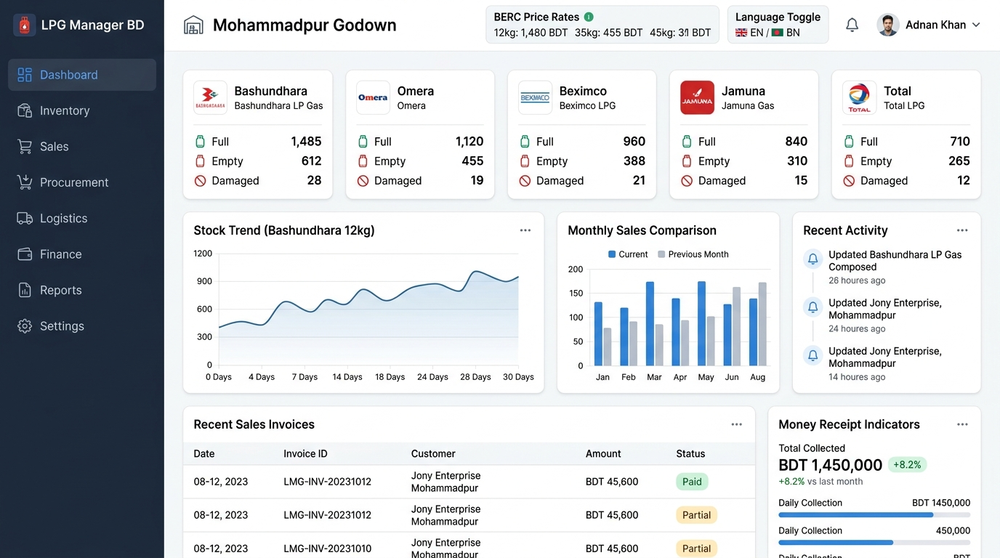
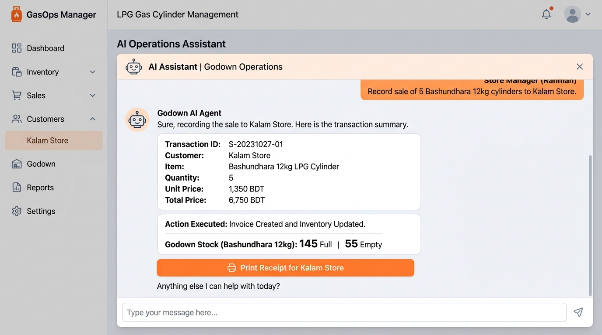

# LPG Manager BD 🇧🇩
### Next-Generation LPG Cylinder Distribution & Godown Management System



[](https://react.dev/)
[](https://www.typescriptlang.org/)
[](https://vitejs.dev/)
[](https://tailwindcss.com/)
[](https://supabase.com/)
[](https://ai.google.dev/)
[](LICENSE)

**LPG Manager BD** is a desktop-first, offline-capable Enterprise Resource Planning (ERP) suite engineered specifically for Liquefied Petroleum Gas (LPG) distributors, dealers, and godown operators across Bangladesh.

Built with real-time cylinder physical tracking, BERC (Bangladesh Energy Regulatory Commission) government tariff compliance, dual-currency/cylinder ledgers, multilingual Bengali/English support, and a database-aware **AI Godown Operations Agent** powered by Google Gemini and OpenAI-compatible models.

---

## 📸 Interface Previews

### 1. Operations Dashboard & Godown Inventory
Live visibility into full cylinders, empty cylinder stock returned by retailers, damaged/leaking cylinders, cashbook reserves, and daily sales metrics.


### 2. AI Godown Operations Agent
Chat with an intelligent godown assistant that has real-time awareness of your inventory and financial ledger. Issue plain English or Bengali commands to automatically record sales, receive empties, log expenses, and update stock in 1 click.



---

## 🌟 Key Features

### 1. 🔄 Dual-Ledger Cylinder Tracking
In the LPG industry, a sale is never just financial—every cylinder leaves with gas and must return empty. LPG Manager BD tracks both sides:
- **Cash Ledger:** Invoice amount, payments (Cash, bKash, Nagad, Bank), and customer accounts receivable.
- **Cylinder Physical Ledger:** Full cylinders issued vs. Empty cylinders returned vs. Deposit/Due cylinders held by customers and suppliers.
- **Stock States:** Track `Full Stock`, `Empty Stock`, `Damaged Stock`, `Lost Stock`, `Customer-Held Stock`, and `Supplier-Held Stock`.

### 2. 🇧🇩 Bangladesh LPG Market Native
- **Multi-Brand Compatibility:** Preconfigured for all major operators in Bangladesh:
  - **Bashundhara LP Gas**
  - **Omera LPG**
  - **Beximco LPG**
  - **Jamuna Gas**
  - **TotalGas**
  - **BM Energy**
  - **Fresh / Meghna LPG**
  - **Petromax LPG**
  - **Sena Kalyan LPG**
  - **Promita LPG**
- **Cylinder Sizes:** Domestic 12kg, Commercial 35kg, Industrial 45kg, plus auto-gas and small sizes (5.5kg).
- **BERC Tariff Compliance:** Track monthly government-notified BERC benchmark consumer prices vs. dealer purchase cost to monitor distributor profit margins.

### 3. 🤖 Database-Aware AI Godown Operations Agent
- **Natural Language Execution:** Execute complex operations by speaking or typing naturally:
  - *"Sell 5 Bashundhara 12kg cylinders to Kalam Store for 7000 cash with 5 empties exchanged."*
  - *"Receive 10,000 tk payment from Bismillah Hotel via bKash."*
  - *"Mark 2 Omera 12kg cylinders as damaged due to pinhole leak."*
  - *"Record 1,500 tk transport fuel expense for vehicle TA-11-1234."*
- **Real-Time Database Snapshot:** Injects current stock levels, customer balances, and cashbook status into every conversation turn.
- **Interactive Action Cards:** Displays structured transaction preview cards with deep-links to View / Print Invoices (`INV-2026-xxxx`), Money Receipts (`MR-2026-xxxx`), and Stock Movement logs.
- **Multi-LLM Provider Switching (In Settings):**
  - **Google Gemini:** `gemini-3.5-flash` (default), `gemini-3.1-flash-lite` (rapid lookups), `gemini-3.1-pro-preview` (audits & reconciliation). Zero client-side API key leakage.
  - **OpenAI-Compatible Providers:** Connect to OpenAI (ChatGPT `gpt-4o`, `gpt-4o-mini`), Groq, DeepSeek, or local Ollama with custom endpoints and API keys.
- **Rich Markdown Formatting:** Tables, numbered steps, code fences with 1-click copy, and bold highlighted metrics.
- **Floating Assistant:** Global slide-over assistant drawer accessible from any screen without interrupting your active workflow.

### 4. 🧾 Point of Sale (POS) & Billing
- **Instant Invoicing:** Generate professional sales invoices with customer type detection (Dealer, Retail Shop, Hotel, Commercial).
- **Print Formats:**
  - Standard **A4 Office Invoice** with BERC license, BIN, and distributor details.
  - **80mm POS Thermal Slip** for fast counter receipts.
  - **Delivery Challan (`DC-2026-xxxx`)** for drivers with vehicle number and empty collection targets.
- **Flexible Settlement:** Full Exchange (1:1), Partial Exchange (Empty Due), Cylinder Deposit (`৳2,200` standard), or Permanent Sale.

### 5. 👥 Customers & Suppliers Management
- **Customer Profiles:** Credit limits, payment terms, phone numbers, delivery areas (Mohammadpur, Mirpur, Dhanmondi, etc.), and outstanding cylinder holding counts.
- **Supplier Ledger:** Manage orders, empty returns to plant, and payable balances for gas bottling companies.

### 6. 💰 Accounts & Daily Cashbook
- **Accounts:** Separate balances for **Cash in Hand**, **bKash Merchant**, **Nagad**, and **Bank Accounts**.
- **Money Receipts (`MR`):** Auto-generated on customer payment collection.
- **Expense Vouchers (`EV`):** Track godown rent, driver tips, vehicle diesel/CNG, labor handling charges, and maintenance.

### 7. 🔐 Role-Based Access Control (RBAC)
Dedicated permissions and views tailored to godown personnel:
| Role | Permissions |
|---|---|
| **Admin / Owner** | Full system control, financial reports, user management, audit logs, AI settings, Supabase sync |
| **Manager** | Sales, purchases, customer credit approvals, price overrides, godown audits |
| **Accountant** | Invoicing, payment collection, money receipts, expense vouchers, cashbook reconciliation |
| **Store Keeper** | Cylinder stock in/out, empty returns, damaged cylinder reporting, godown physical counts |
| **Sales Rep** | New orders, customer ledger check, godown pickup billing |
| **Delivery Driver** | Delivery challans view, empty collection confirmation |

### 8. 🌐 Bilingual Localization & Offline First
- **Languages:** Instant toggle between English and Bengali (**বাংলা**) across all views, tables, receipts, and menus.
- **Offline First:** Operates smoothly on local machine storage (`localStorage`) during internet outages, syncing automatically to Supabase PostgreSQL when reconnected.
- **Data Export & Import:** One-click manual backup of the entire database into **JSON** or **CSV** formats in **Settings > Backup & Export**.

---

## 🛠️ Tech Stack & Architecture

- **Frontend:** React 19, TypeScript, Vite 6, Tailwind CSS 4
- **Backend / Proxy:** Node.js Express (`server.ts`) running concurrently with Vite dev server
- **Database & Auth:** Supabase PostgreSQL with Row Level Security (RLS) + LocalStorage Fallback
- **AI Engine:** `@google/genai` TypeScript SDK (server-side proxied) & OpenAI-compatible REST proxy
- **Icons & Visualization:** Lucide React, Recharts

---

## 🚀 Quick Start Guide

### Prerequisites
- [Node.js](https://nodejs.org/) v18.0.0 or higher
- `npm` or `yarn`

### 1. Clone the Repository
```bash
git clone https://github.com/your-username/lpg-manager-bd.git
cd lpg-manager-bd
```

### 2. Install Dependencies
```bash
npm install
```

### 3. Configure Environment Variables
Copy `.env.example` to `.env`:
```bash
cp .env.example .env
```
Populate your environment variables:
```ini
# Gemini API Key (Required for server-side AI Godown Agent)
GEMINI_API_KEY="your-gemini-api-key-here"

# Application URL
APP_URL="http://localhost:3000"

# Optional Supabase Database Connection
VITE_SUPABASE_URL="https://your-project.supabase.co"
VITE_SUPABASE_ANON_KEY="your-supabase-anon-key"
```

### 4. Start Development Server
```bash
npm run dev
```
The application will launch on `http://localhost:3000`.

### 5. Build for Production
```bash
npm run build
```

---

## ☁️ Deployment on Vercel

The project is preconfigured for zero-friction deployment to Vercel via `vercel.json`.

1. Push your repository to GitHub or GitLab.
2. In the [Vercel Dashboard](https://vercel.com/), click **Add New > Project** and import the repository.
3. Configure the build settings:
   - **Framework Preset:** Vite
   - **Build Command:** `npm run build`
   - **Output Directory:** `dist`
4. Add your Environment Variables in Vercel Project Settings:
   - `GEMINI_API_KEY`: Your Google AI Studio API key
   - `VITE_SUPABASE_URL`: Your Supabase Project URL
   - `VITE_SUPABASE_ANON_KEY`: Your Supabase Public Anon Key
5. Click **Deploy**.

---

## 📖 Godown Daily Usage Workflow

### 1. Morning Routine: Godown Physical Audit
1. Open **Reports > Daily Cylinder Audit**.
2. Verify morning opening full cylinders against the physical stack.
3. Check previous day cash balance in **Accounts > Cashbook**.

### 2. Counter Sales & Retail Deliveries
1. Navigate to **Sales > New Sale Invoice** (or press shortcut `N`).
2. Select Customer (e.g., *Kalam Store*).
3. Add Cylinders (e.g., *Bashundhara 12kg* - Quantity: 10).
4. Enter Empties Received (e.g., 10 exchanged, or 8 returned with 2 remaining due).
5. Choose Payment Method: Cash, bKash, or Credit.
6. Click **Generate & Print Invoice** (Choose A4 or 80mm POS Slip).

### 3. Using the AI Godown Operations Agent
Click the **AI Agent** button in the TopBar or use the Floating Widget in the bottom-right corner:
- **Ask Stock Inquiries:** *"How many 12kg full cylinders are in stock across all brands?"*
- **Ask Dues:** *"Show me top 5 customers with overdue payment."*
- **Execute Transactions:** *"Sell 3 Omera 12kg to Bismillah Hotel for cash with 3 empties."*
- **Confirm Actions:** The agent generates an interactive card; click **Confirm & Execute** (or enable Auto-Execute in Settings).

### 4. Evening Settlement
1. Open **Reports > Daily Report**.
2. Review Total Cylinders Sold, Total Empties Collected, Total Cash Collected, and Pending Deliveries.
3. Take a manual backup via **Settings > Backup & Export** (Export JSON).

---

## ⌨️ Keyboard Shortcuts

| Shortcut | Action |
|---|---|
| `Ctrl + K` / `Cmd + K` | Open Global Search Palette |
| `Alt + S` | Navigate to Sales |
| `Alt + I` | Navigate to Inventory Stock |
| `Alt + C` | Open Customers List |
| `Alt + A` | Open AI Godown Agent |
| `Escape` | Close active modals & slide-overs |

---

## 📄 License

Distributed under the MIT License. See `LICENSE` for more information.

---

**Developed with ❤️ for the LPG Distribution Community of Bangladesh.**
